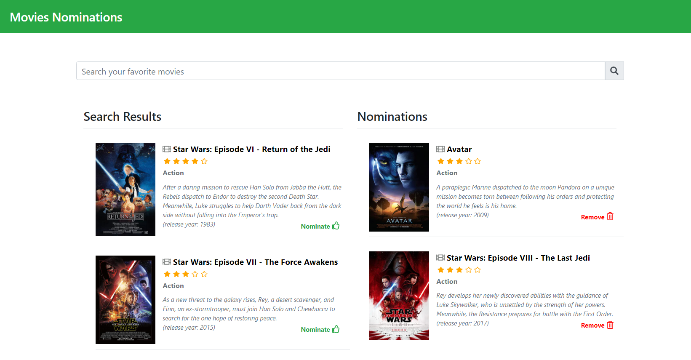
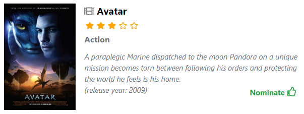
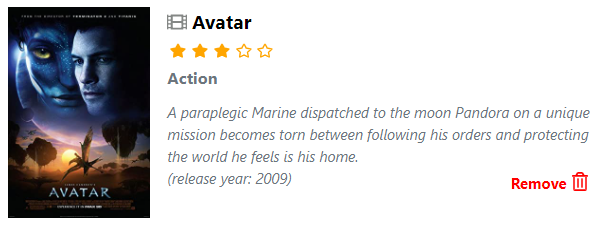

# Movies Nominations Demo Web App

## **About**

This is a demo app meant for Shopify job application.
It uses IMDB free web API to display a list of movies based on user search, with ability to nominate up to 5 movies.

---

## **Development Stack and dependencies**

| Library     | Description                                          |
| ----------- | ---------------------------------------------------- |
| React.js    | FE JS Library                                        |
| Bootstrap   | for common css [plus custom css placed in index.css] |
| Fontawesome | for icons                                            |
| Axios       | for API fetch calls                                  |
| cuid        | for react map list unique keys                       |

---

## **Online Access**

This app has been deployed to Netlify, use below link to access the online version.

[Movie Nominations App](https://movienominationsapp.netlify.app/)

---

## Features List

| Feature               | Description                                                                                                                                                                                                                                                                            |
| --------------------- | -------------------------------------------------------------------------------------------------------------------------------------------------------------------------------------------------------------------------------------------------------------------------------------- |
| Search Box            | Text will be trimmed, to execute hit enter or click on the search icon                                                                                                                                                                                                                 |
| Search Results        | List of returned search results                                                                                                                                                                                                                                                        |
| Nominations           | List of nominated movies by the user                                                                                                                                                                                                                                                   |
| Movie Info card       | The search results are summarized in a horizontal card - sample show below                                                                                                                                                                                                             |
| Nominated Movie card  | Once a movie gets nominated, it shows up under the Nominations list, the nominate button will get disabled. to remove a nominee, simply click the Remove button which will remove the movie from the nominations list, and re-activate the nominate button on the search results list. |
| Stars Rating          | Each movie has Stars rating (out of 5 stars) to show the IMDB rating in visual representation.                                                                                                                                                                                         |
| Persistent Nomination | Nominations are stored persistently on the client local storage so they are retained in case user leaves the page.                                                                                                                                                                     |

---

## Installation on a local machine instructions

If you prefer to install a local version of this app, please follow the following simple instructions on VsCode or your preferred IDE.

1. Clone the repo to your local machine, using Bash Git terminal

`git clone https://github.com/3mrfouad/MoviesNominationsApp`

2. change directory inside the project folder

`cd MoviesNominationsApp`

3. run below command to install required dependencies

`npm install`

4. run below command to start the application

`npm start`

It will automatically open [http://localhost:3000](http://localhost:3000) to view it in the browser.

The page will reload if you make edits.\
